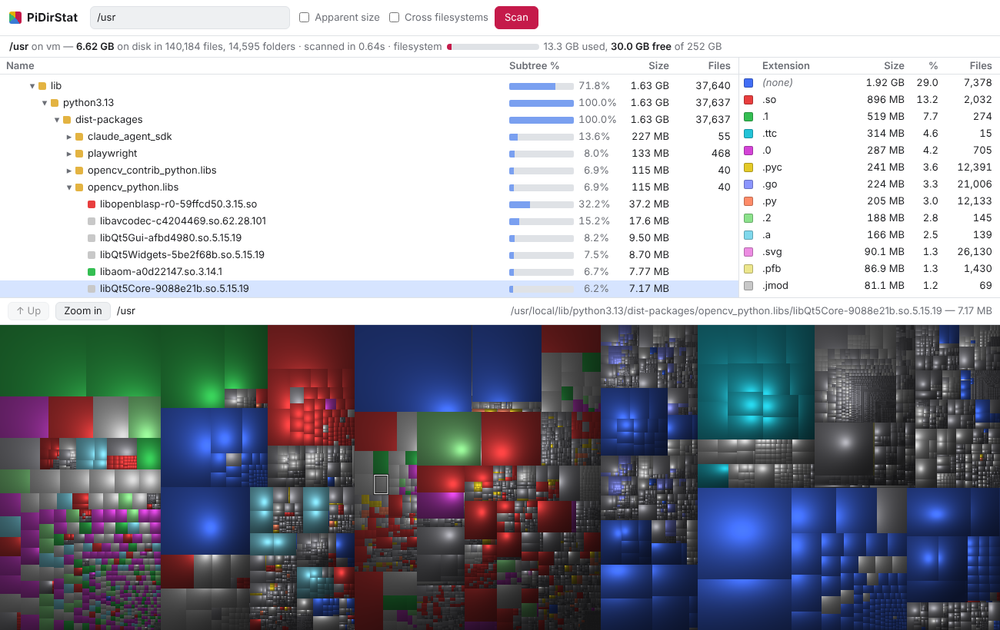

# PiDirStat


A WinDirStat-style disk usage viewer for **Raspberry Pi**, Linux, Mac and Windows.
One Python file, standard library only — nothing to install besides Python 3.

It scans a folder (the whole SD card by default) and serves an interactive viewer
you open in a browser, on the Pi itself or from any phone or laptop on your network.
That means it works on a Pi with no screen too.



## What you get

- **Folder tree** sorted by size, with a bar showing each folder's share of its parent.
- **File-type list** with sizes and counts. Click a type to highlight just those files in the map.
- **Shaded block map** (cushion treemap) like WinDirStat. Click a block to select it,
  double-click to zoom into its folder, right-click to zoom back out.
- **Scan box** to scan another folder from the page, and a bar showing how full the disk is.

Huge cards stay fast: tiny files are grouped into a single `<N smaller files>` block.

## Raspberry Pi / Linux

```bash
sudo python3 pidirstat.py /
```

Then open `http://<pi-name>.local:8088` from another device, or `http://localhost:8088` on the Pi.
Without `sudo` it still works but skips folders only root can read.
You can also double-click `start-pidirstat.sh` (it adds `--open` so the browser opens on the Pi).

## Windows

1. Install Python from [python.org](https://www.python.org/downloads/) if you don't have it.
2. Double-click **`Start PiDirStat (Windows).bat`** — or run `py pidirstat.py C:\`.
3. Your browser opens to the viewer by itself.

Run it as administrator to include protected folders. On Windows, sizes are always file
sizes (Windows doesn't report on-disk allocation), junctions/symlinks are skipped so nothing
is counted twice, and the viewer stays private to your PC unless you add `--host 0.0.0.0`.

## Options

| Option | What it does |
|---|---|
| `--cross-fs` | Also scan USB drives and other disks mounted inside the folder |
| `--apparent` | Count file sizes instead of space used on disk |
| `--html FILE` | Save a standalone HTML report and exit (no server needed to view it) |
| `--host HOST` | Address to listen on (Pi default `0.0.0.0` = your network; Windows default `127.0.0.1`) |
| `--port N` | Port to use (default `8088`) |
| `--open` | Open a browser when it starts (always on for Windows) |
